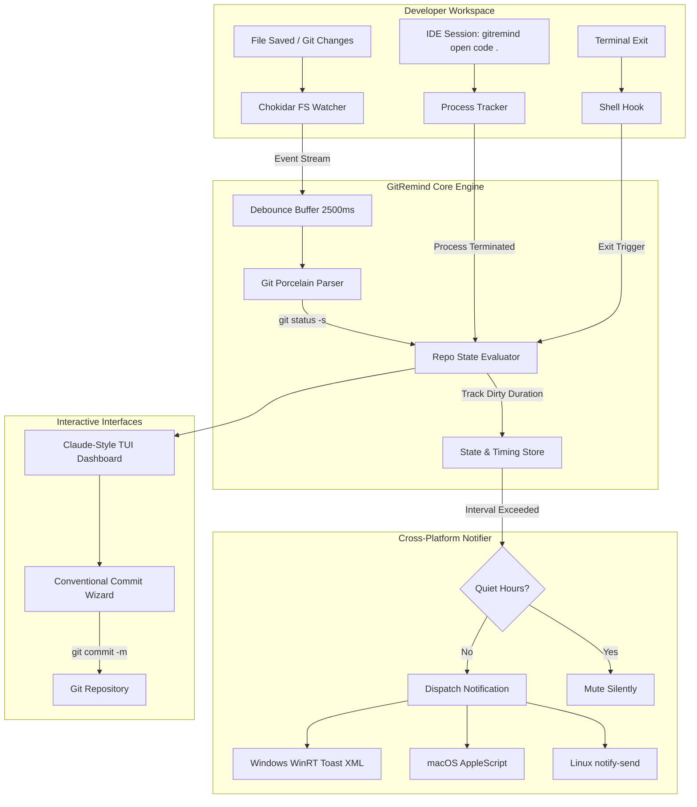

# 🔔 GitRemind

<p align="center">
  
</p>

<p align="center">
  <strong>Intelligent background Git watcher & uncommitted changes daemon with a Claude CLI-style dashboard, smart commit reminders, conventional commit wizard, and native desktop notifications.</strong>
</p>

<p align="center">
  <a href="https://github.com/gitremind/gitremind/stargazers"></a>
  <a href="https://www.npmjs.com/package/gitremind"></a>
  <a href="https://nodejs.org"></a>
  <a href="https://www.typescriptlang.org"></a>
  <a href="#-test-suite"></a>
  <a href="LICENSE"></a>
  
</p>

---

> ### 💡 The Hook
> **Never lose uncommitted work or leave your workstation without committing again.**  
> GitRemind watches your local repositories in the background, tracks file system mutations, and gently alerts you with native desktop toast notifications whenever work sits uncommitted for too long or when you close your IDE.

---

## 🖥️ Claude CLI-Style Terminal Dashboard

Run `npx gitremind` or `gitremind dashboard` at any time to open the interactive terminal dashboard:

```text
  ____ _ _   ____                 _           _ 
 / ___(_) |_|  _ \ ___ _ __ ___ (_)_ __   __| |
| |  _| | __| |_) / _ \ '_ ` _ \| | '_ \ / _` |
| |_| | | |_|  _ <  __/ | | | | | | | | | (_| |
 \____|_|\__|_| \_\___|_| |_| |_|_|_| |_|\__,_|
  GitRemind • Intelligent Git Tracker & Interactive Committer
──────────────────────────────────────────────────────────────────────────────
╭─ Live System Status ─────────────────────────────────────────────────────────╮
│   Daemon       : 🟢 Active [PID: 14082]    Watch Interval : 20 min           │
│   Watched Repos: 3 (1 dirty)               Quiet Hours    : Disabled         │
╰──────────────────────────────────────────────────────────────────────────────╯
╭─ Watched Repositories (3) [Navigate: ↑ / ↓] ─────────────────────────────────╮
│ ▸ [1] frontend-app          (main)           🟢 Clean (All changes committed) │
│   [2] payment-service       (feature/stripe) 🟡 Dirty (4 uncommitted files)  │
│   [3] documentation-site    (main)           🟢 Clean (All changes committed) │
╰──────────────────────────────────────────────────────────────────────────────╯
╭─ Active Repository Details: payment-service ─────────────────────────────────╮
│   Repository  : payment-service [C:\Users\dev\projects\payment-service]      │
│   Branch      : feature/stripe                                               │
│   Last Commit : 9bf2a14 "feat(stripe): add webhook signature validation"     │
│   Uncommitted : Active for 14 minutes ago                                    │
│   Summary     : 2 modified, 1 untracked, 1 staged, 0 deleted                 │
│                                                                              │
│   Pending Changed Files:                                                     │
│     [A]  src/webhooks/stripe-handler.ts                                      │
│     [M]  src/config/stripe.ts                                                │
│     [M]  src/services/billing.ts                                             │
│     [?]  tests/stripe-webhook.test.ts                                        │
╰──────────────────────────────────────────────────────────────────────────────╯
  ⚡ Auto-refreshing every 4s. Press [r] to refresh now.
  [c] Commit  │  [w] Watch  │  [u] Unwatch  │  [s] Daemon  │  [n] Notify  │  [r] Refresh  │  [q] Exit
```

---

## ✨ Key Features

| Feature | Description |
| :--- | :--- |
| ⚡ **Real-Time Change Detection** | Powered by `chokidar` file watchers and `git status --porcelain=v1 -uall`. Automatically detects modified (`[M]`), untracked (`[?]`), staged (`[A]`), deleted (`[D]`), and conflicted (`[!]`) files with millisecond responsiveness. |
| ⏰ **Smart Interval Reminders** | Configurable notification cooldown (default: `20 minutes`). If dirty changes linger without a commit, GitRemind sends a non-intrusive desktop alert with file summaries. |
| 🚪 **Project & IDE Close Detection** | Launch your editor via `gitremind open code .` (or Cursor, IntelliJ, WebStorm, Sublime). When you exit your IDE, GitRemind instantly warns you if you forgot uncommitted files. |
| 💻 **Claude CLI-Style Dashboard** | Gorgeous retro-styled TUI featuring real-time health pills, live repository switcher, pending diff previews, and single-keypress actions. |
| 🪄 **Conventional Commit Wizard** | Run `gitremind commit` for an interactive, step-by-step prompt that enforces Conventional Commits (`feat`, `fix`, `docs`, `refactor`, `perf`, `test`, `chore`), auto-stages files, and formats your message. |
| 🪟 **Native Desktop Notifications** | Pure native OS toast cards! Uses native Windows WinRT XML Toast notifications (zero C++ compile dependencies), native macOS AppleScript notifications, and Linux `notify-send`. |
| 🐚 **Shell Exit Hooks** | Integrates into your shell (`PowerShell`, `Bash`, `Zsh`) to prevent accidental terminal exits with uncommitted changes. |
| 🔋 **Near-Zero Resource Usage** | 2500ms intelligent event debouncing suppresses notifications during large builds, `npm install`, or git checkouts. Consumes <35MB RAM and negligible CPU. |
| 🌙 **Quiet Hours Mode** | Silence notifications automatically during meetings, deep focus, or overnight hours (e.g., `23:00 - 08:00`). |

---

## 🚀 Quick Start

### 1. Instant Execution (No Install Required)
You can launch the GitRemind terminal dashboard directly in any Git repository using `npx`:

```bash
npx gitremind
```

### 2. Global Installation
Install GitRemind globally via npm:

```bash
npm install -g gitremind
```

Verify your installation:

```bash
gitremind --help
```

---

## 🛠️ Typical Workflow & Guide

### Step 1: Add a Repository to Watch List
Navigate to your repository and add it to the GitRemind watch list:

```bash
cd ~/projects/my-app
gitremind watch
```

### Step 2: Start the Background Daemon
Start the lightweight background daemon process:

```bash
gitremind start
```

*To check daemon health and running status:*
```bash
gitremind status
```

### Step 3: Open Project with IDE Close Protection
Launch your favorite editor through GitRemind:

```bash
# Visual Studio Code
gitremind open code .

# Cursor AI Editor
gitremind open cursor .

# JetBrains IntelliJ / WebStorm
gitremind open idea .
```
> If you close the IDE while uncommitted changes exist, GitRemind immediately displays a desktop notification card with audio chime:  
> **"GitRemind: Project Closed! 4 uncommitted file(s) remain in my-app!"**

### Step 4: Fast Conventional Commits
Whenever you are ready to commit, launch the interactive commit wizard:

```bash
gitremind commit
```

Or pass flags directly for lightning-fast commits:

```bash
gitremind commit -t feat -s auth -m "add oauth2 callback handler" -y
```

---

## 📖 Complete CLI Reference Manual

| Command | Alias | Description |
| :--- | :--- | :--- |
| `gitremind` | `gitremind dashboard`, `gitremind ui` | Launches the interactive Claude CLI-style terminal dashboard. |
| `gitremind status` | — | Prints system overview, daemon status, configuration, and current repo health card. |
| `gitremind start` | — | Starts the GitRemind background monitoring daemon (detached process). |
| `gitremind start -f` | — | Runs the daemon in the foreground of the current terminal for debugging. |
| `gitremind stop` | — | Gracefully stops the active background daemon. |
| `gitremind restart` | — | Restarts the background daemon and reloads all repository watchers. |
| `gitremind watch [path]` | — | Adds repository at `[path]` (default: current directory) to watch list. |
| `gitremind unwatch [path]` | — | Removes repository at `[path]` from the watch list. |
| `gitremind list` | — | Displays all watched repositories with their live uncommitted file status. |
| `gitremind check [path]` | — | Immediately inspects repository and dispatches a desktop toast alert if dirty. |
| `gitremind commit [path]` | `gitremind wizard` | Opens the interactive Conventional Commit wizard. |
| `gitremind open <editor> [args...]` | — | Spawns an IDE session and alerts upon process termination if uncommitted files remain. |
| `gitremind config` | — | Displays the current configuration settings and config file location. |
| `gitremind config <key> <val>` | — | Updates a setting (`interval`, `sound`, `close`, `lang`). |
| `gitremind notify [msg]` | — | Fires a test native desktop toast notification. |
| `gitremind hook <shell>` | — | Prints shell integration hook for `powershell`, `bash`, or `zsh`. |

---

## ⚙️ Configuration (`~/.gitremind/config.json`)

GitRemind stores user configuration at `~/.gitremind/config.json` (`%USERPROFILE%\.gitremind\config.json` on Windows).

```json
{
  "version": 1,
  "intervalMinutes": 20,
  "notifyOnClose": true,
  "sound": true,
  "language": "en",
  "watchedRepos": [
    {
      "path": "C:\\Users\\dev\\projects\\my-app",
      "name": "my-app",
      "addedAt": "2026-10-04T18:00:00.000Z"
    }
  ],
  "ignorePatterns": [
    "**/node_modules/**",
    "**/.git/**",
    "**/dist/**",
    "**/build/**",
    "**/.next/**",
    "**/.cache/**",
    "**/target/**"
  ],
  "ideProcesses": [
    "code.exe",
    "code",
    "cursor.exe",
    "cursor",
    "idea64.exe",
    "webstorm64.exe",
    "pycharm64.exe"
  ],
  "quietHours": {
    "enabled": false,
    "start": "23:00",
    "end": "08:00"
  }
}
```

### CLI Configuration Commands

```bash
# Change reminder cadence to 15 minutes
gitremind config interval 15

# Enable or disable audio chime
gitremind config sound true
gitremind config sound false

# Enable or disable IDE close notifications
gitremind config close true

# Set language to English or Turkish
gitremind config lang en
gitremind config lang tr
```

---

## 🐚 Shell Exit Hook Integration

Prevent accidentally closing your terminal when you have uncommitted changes.

### PowerShell (`$PROFILE`)

Run `gitremind hook powershell` or add the following to your `$PROFILE`:

```powershell
Register-EngineEvent PowerShell.Exiting -Action {
    try {
        if (git rev-parse --is-inside-work-tree 2>$null) {
            $dirty = git status --porcelain=v1 2>$null
            if ($dirty) {
                Write-Host "`n[GitRemind] ⚠️  WARNING: Exiting terminal but uncommitted changes remain!" -ForegroundColor Yellow
                git status -s
                gitremind check 2>$null
            }
        }
    } catch {}
} | Out-Null
```

### Bash & Zsh (`~/.bashrc` / `~/.zshrc`)

Run `gitremind hook bash` or `gitremind hook zsh` or append to your RC file:

```bash
gitremind_exit_hook() {
    if git rev-parse --is-inside-work-tree >/dev/null 2>&1; then
        if [ -n "$(git status --porcelain=v1 2>/dev/null)" ]; then
            printf "\n\033[1;33m[GitRemind] ⚠️  WARNING: Uncommitted changes detected before exit!\033[0m\n"
            git status -s
            gitremind check >/dev/null 2>&1 &
        fi
    fi
}
trap gitremind_exit_hook EXIT
```

---

## 🏗️ Architecture & How It Works



---

## 🧪 Test Suite

GitRemind includes comprehensive test suites covering configuration persistence, porcelain output parsing across all Git file states, process tracking, notification formatting, and TUI components.

```bash
npm test
```

```text
✔ ConfigManager (2 tests passed)
✔ Git Parser & Inspector (7 tests passed)
✔ Notifier formatting & quiet hours (3 tests passed)
✔ ProcessTracker (2 tests passed)
✔ Commit Wizard & Git Operations (3 tests passed)
✔ TUI Utility Library (8 tests passed)

Total: 25 tests passing (100%)
```

---

## 📄 License

Distributed under the **MIT License**. See `LICENSE` for more information.

---

## 🔍 SEO & Discoverability Keywords

<!-- SEO-KEYWORDS-START -->
`git reminder` • `git watcher` • `uncommitted changes reminder` • `git commit reminder` • `git auto commit reminder` • `developer productivity tool` • `developer CLI tool` • `background git daemon` • `git notification desktop` • `windows toast git reminder` • `git dirty repository alert` • `git uncommitted changes alert` • `git change detection` • `conventional commits cli wizard` • `claude cli style dashboard` • `terminal git dashboard` • `git idle reminder` • `ide close git reminder` • `git hooks terminal exit` • `git workstation protection` • `prevent lost code`
<!-- SEO-KEYWORDS-END -->
